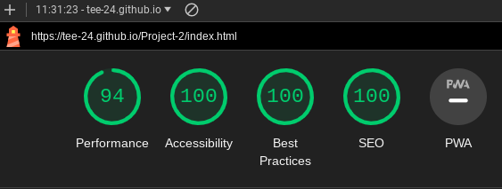
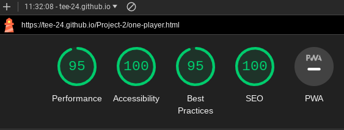
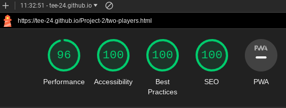
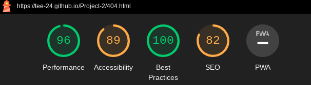

## Deployment & Local Development

### Deployment
The website was deployed to GitHub pages via the following steps:
1. Log in (or sign up) to Github
2. Go to the repository for this project
3. Click settings 
4. Under code and automation, click pages
5. Select main branch
6. Click save

### Local Development

#### How to Fork
To fork the repository:
1. Log in (or sign up) to Github
2. Go to the repository for this project
3. Click the Fork button in the top right corner

#### How to Clone
To clone the repository:
1. Log in (or sign up) to Github
2. Go to the repository for this project
3. Click on the code button, select whether you would like to clone with HTTPS, SSH or GitHub CLI
4. Copy the link shown
5. Open the terminal in your code editor and change the current working directory to the location you want to use for the cloned directory
6. Type 'git clone' into the terminal 
7.  Paste the link you copied in step 3
8. Press enter

## Testing 
Testing was ongoing throughout the entire build. I utilized Chrome developer tools while building to pinpoint and troubleshoot any issues as I went along.

### Lighthouse Testing
I used Lighthouse within the Chrome Developer Tools to allow me to test the performance, accessibility, best practices and SEO of the website.

Landing Page

1 Player Page

2 Player Page

404 Error Page

### W3C Validator
The W3C validator was used to validate the HTML on all pages of the website. 

* [Landing Page-HTML](assets/docs/w3c-landing.png)

### Known Bugs

1. After clicking the play again button, the result is no longer printed to the display. However, thescores are still updating accordingly

### Full Testing
To fully test my website I performed the following testing using a number of browsers (google chrome, safari, mozilla firefox) and devices (HP laptop, iPad Pro 12.9 inch, iPhone 11 pro max).

| Test                                         | Action                                                                                                                                                                      | Expected Result                                                                                                                                                                                                                                                   | Pass/Fail |
| -------------------------------------------- | --------------------------------------------------------------------------------------------------------------------------------------------------------------------------- | ----------------------------------------------------------------------------------------------------------------------------------------------------------------------------------------------------------------------------------------------------------------- | --------- |
| Test start game button        | Click the start game button                                                                            | Displays 1 player button and 2 player button                                                                                                                                                                         | Pass      |
| Test hover effect on buttons | Place mouse over each button                                                                                                                     | Background color should turn aqua                                                                                                                                                                                                                                      | Pass      |
| Test instructions button                      | Click the instructions button                                                             | Opens instruction modal                                                                                                                                                                                                                                        | Pass      |
| Test closing modal                   | Click x at the top                                                                                                                                      |Modal closes                                                                                                     | Pass      |
| Test 1 player game   | Click on a choice                                                                                                                            | Score should increase for the winner                                                                                                                                                                                                                                     | Pass      |
| Test 2 player game                            | Click on a choice for player 1 Click on a choice for player 2                                                        | Pass      |
| Test play again button                           | Click play again button                                                       | Buttons should be re-enabled Display area should be clear 
| Test back to homepage button                           | Click back to homepage button                                                       | Landing page should open                                                                                                                                                                  | Pass      |
  |

## Credits
* Fonts were sourced from [Google Fonts](https://fonts.google.com/)
* Favicon was sourced from [Favicon Generator](favicon.io)
* *Images were compressed by [iLoveIMG](https://www.iloveimg.com/)
* Button disabled property was learned from [W3 Schools](https://www.w3schools.com/jsref/prop_pushbutton_disabled.asp)
* Modal box was learned from [W3 Schools](https://www.w3schools.com/howto/howto_css_modals.asp)
* [Table to Markdown](https://tabletomarkdown.com/) was used to cnvert Google sheets to Markdown language

### Acknowledgements
This game was designed and developed in conjunction with the Full Stack Software Developer Diploma course (ecommerce) at the Code Institute. I would like to thank my mentor, Daisy, the Slack community, and Code Institute for all their support.